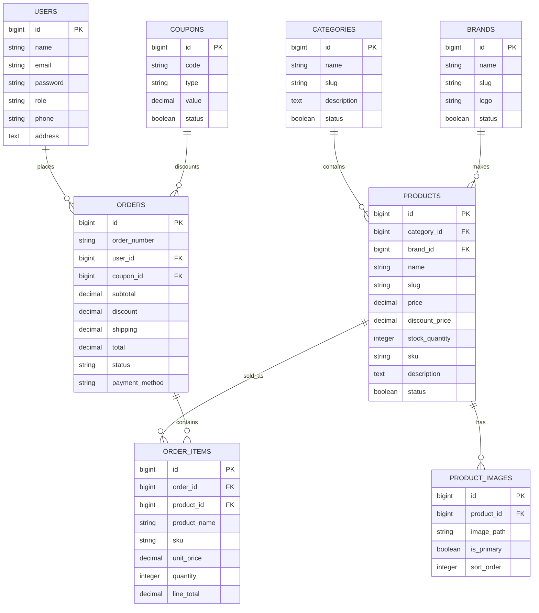

# ShopSphere Laravel 12 Ecommerce

ShopSphere is a readable Laravel 12 ecommerce website built with PHP 8.3, MySQL, Bootstrap 5, and Blade. It includes a responsive storefront, customer auth, cart, COD checkout, order history, invoices, and a protected admin panel.

## Main Features

- Storefront home page with hero slider, categories, featured products, new arrivals, product search, cart, checkout, about, contact, and live chat placeholder.
- Customer registration/login, dashboard, order history, invoice, and tracking status.
- Admin panel for dashboard statistics, products, categories, brands, orders, customers, coupons, banners, and site settings.
- Migrations, Eloquent models, relationships, factories, seeders, repository/service layers, validation, CSRF, auth middleware, admin middleware, and policies.

## Installation

```bash
composer install
cp .env.example .env
php artisan key:generate
php artisan migrate --seed
php artisan serve
```

Create a MySQL database named `shopsphere` first, or update these `.env` values:

```env
DB_CONNECTION=mysql
DB_HOST=127.0.0.1
DB_PORT=3306
DB_DATABASE=shopsphere
DB_USERNAME=root
DB_PASSWORD=
```

Demo accounts after seeding:

- Admin: `admin@example.com` / `password`
- Customer: `customer@example.com` / `password`

## Development Notes

- Editable CSS lives in `public/css/site.css`.
- Editable JavaScript lives in `public/js/site.js`.
- Storefront Blade files live in `resources/views/frontend`.
- Admin Blade files live in `resources/views/admin`.
- Cart and order business logic live in `app/Services`.
- Product querying lives behind `App\Repositories\Contracts\ProductRepositoryInterface`.

## Database Schema Diagram



## Production Checklist

- Set `APP_ENV=production` and `APP_DEBUG=false`.
- Configure a real mailer and queue worker if contact/support notifications are added.
- Replace demo image URLs with hosted product assets or Laravel storage uploads.
- Put the app behind HTTPS and configure secure session cookies.
- Run `php artisan config:cache`, `route:cache`, and `view:cache` during deployment.
